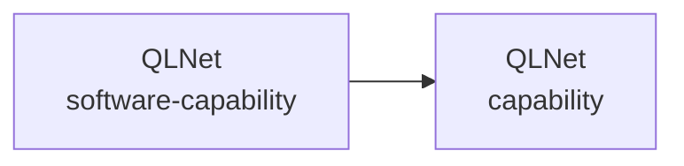

# Commercial Architecture — QLNet

> Generated from `.architecture/commercial.json`. Do not edit directly; run `python .architecture/generate.py`.

Status: **UNASSESSED**

## Commercial schema

## Inventory

- Actors: **0**
- Capabilities: **1**
- Value streams: **0**
- Channels: **0**
- Commercial dependencies: **0**
- Revenue streams: **0**
- Cost drivers: **0**
- Risks: **0**

## Update rule

Commercial facts remain `UNASSESSED` until validated. Architecture-impacting commits must update the relevant raw source and regenerate this view.
