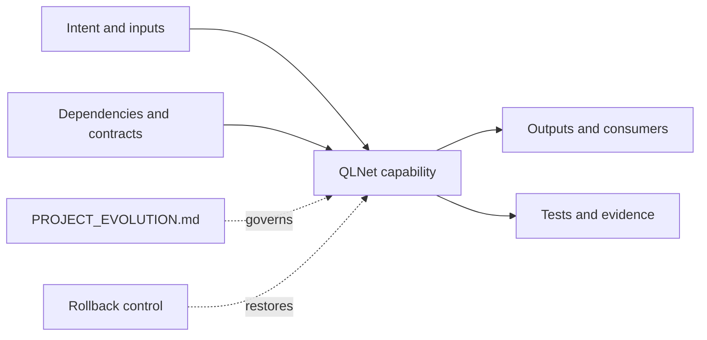

# Project Evolution — QLNet

> Living source of truth for intent, delivery state, decisions, evidence, rollout, rollback, and the next action. Update it in the same change as the work it describes.

<!-- evolution:reviewed=2026-08-23; owner=antonysc -->

## Start Here

| Field | Current truth |
|---|---|
| Goal | `G-001` — Maintain a reliable C# quantitative-finance library compatible with established QuantLib behavior and supported .NET targets. |
| State | `active` |
| Last reviewed | `2026-08-23` |
| Current release | `REL-001` — evolution documentation rollout |
| Next step | antonysc — validate this baseline against current priorities and promote the first project delivery item — review by 2026-09-06 |
| Why this next | It converts inferred repository intent into an owned, measurable delivery choice. |

<!-- evolution:auto:current:start -->
_No automated source-commit records yet._
<!-- evolution:auto:current:end -->

## Evolving Goal

### Current outcome

Maintain a reliable C# quantitative-finance library compatible with established QuantLib behavior and supported .NET targets.

### Success measures

| Measure | Baseline | Target | Evidence source | Review date |
|---|---|---|---|---|
| Project outcome | Current repository evidence; explicit target not yet confirmed | Owner confirms one measurable outcome and acceptance signal | Tests, release evidence, or linked operational metric | 2026-09-06 |
| Evolution traceability | No canonical living record | Every meaningful change updates this document in the same pull request | Pull-request history and repository-evolution check | Continuous |

### Constraints and non-goals

- Constraint: preserve existing behavior, history, and repository-specific contribution rules.
- Non-goal: this baseline does not claim unverified completion, production readiness, or undocumented dependencies.

### Goal history

| Goal ID | From | To | Status | Why it changed | Decision |
|---|---|---|---|---|---|
| `G-001` | 2026-08-23 | current | `active` | Initial living baseline derived from repository evidence | `D-001` |

## Repository Cartography

### Structural tree

```text
repository/
├── .github/  # project component
├── .travis.yml  # configuration
├── ChangeLog.txt  # project knowledge
├── LICENSE  # project component
├── News.txt  # project knowledge
├── QLNet.sln  # .NET solution
├── QLNetOld.sln  # .NET solution
├── README.md  # project knowledge
└── PROJECT_EVOLUTION.md  # goal, state, choices, rollout, rollback, next step
```

### Capability and evidence graph



### Component responsibilities

| Component | Owns | Depends on | Used by | Failure impact | Owner |
|---|---|---|---|---|---|
| `ChangeLog.txt` | project knowledge | Repository-local contracts | Project users or operators | Review before material change | antonysc |
| `LICENSE` | project component | Repository-local contracts | Project users or operators | Review before material change | antonysc |
| `News.txt` | project knowledge | Repository-local contracts | Project users or operators | Review before material change | antonysc |
| `QLNet.sln` | .NET solution | Repository-local contracts | Project users or operators | Review before material change | antonysc |
| `QLNetOld.sln` | .NET solution | Repository-local contracts | Project users or operators | Review before material change | antonysc |
| `_config.yml` | configuration | Repository-local contracts | Project users or operators | Review before material change | antonysc |

### Cross-repository contracts

| Repository/system | Direction | Contract | Compatibility rule | Change owner |
|---|---|---|---|---|
| `Finance` | bidirectional | Repository boundary, data, API, package, or operational contract | Keep changes backward-compatible until dependents are verified | antonysc |
| `Analytics` | bidirectional | Repository boundary, data, API, package, or operational contract | Keep changes backward-compatible until dependents are verified | antonysc |
| `SharpTradeWeb` | bidirectional | Repository boundary, data, API, package, or operational contract | Keep changes backward-compatible until dependents are verified | antonysc |

## Roadmap

| ID | Horizon | Outcome or deliverable | Status | Expected result | Dependencies | Evidence when done | Decision | Next checkpoint |
|---|---|---|---|---|---|---|---|---|
| `R-001` | now | Adopt the living evolution record and maintenance checks | `shipped` | Intent, choices, rollout, rollback, and next action become traceable | none | This document, agent rules, PR template, and CI check | `D-001` | 2026-08-23 |
| `R-002` | next | Validate the goal, map, contracts, and first measurable project outcome | `planned` | Inferred intent is confirmed or superseded with evidence | `R-001` | Owner-reviewed document update | `D-001` | 2026-09-06 |
| `R-003` | later | Automate project-specific delivery evidence | `planned` | Release gates rely on tests or operational signals, not narrative alone | `R-002` | CI, release, and metric links | — | after R-002 |

### Completed and superseded

| ID | Final status | Completed/changed | Actual result | Evidence | Follow-up |
|---|---|---|---|---|---|
| `R-001` | `shipped` | 2026-08-23 | Living evolution governance added | Merge pull request and repository files | `R-002` |

<!-- evolution:auto:roadmap:start -->
_No automated source-commit records yet._
<!-- evolution:auto:roadmap:end -->

## Change Records

### `CHG-001` — Establish living repository evolution governance

| Field | Record |
|---|---|
| Status | `shipped` |
| Planned | Add a repository-local goal, map, roadmap, timeline, choice ledger, fix ledger, rollout, rollback, and maintenance enforcement. |
| Expected | Future contributors can understand current truth and must update it with meaningful changes. |
| Done | Added the evolution record, agent rules, pull-request prompts, and automated freshness check. |
| Fixed | Removed the documentation gap where plans and delivery choices could become disconnected; no product defect is claimed. |
| Choice | `D-001` — repository-local truth with portfolio links |
| Rollout | `REL-001` — merge to the default branch and enforce on later pull requests |
| Rollback | Revert the merge commit if the check blocks valid delivery and cannot be corrected promptly. |
| Evidence | Repository files and merge pull request |
| Next | Follow the single action in **Start Here**. |

<!-- evolution:auto:changes:start -->
_No automated source-commit records yet._
<!-- evolution:auto:changes:end -->

## Decisions

### `D-001` — Keep evolution truth inside each repository

- Date: `2026-08-23`
- Status: `accepted`
- Context: Goals, plans, fixes, decisions, and release recovery need to stay beside the implementation they govern.
- Choice: Maintain `PROJECT_EVOLUTION.md` in every repository, summarized by a portfolio map in `antonysc/Setup`, and couple updates to meaningful pull requests.
- Why: Repository-local truth remains reviewable, versioned, and available during rollout or recovery.
- Alternatives rejected: a central-only backlog — it drifts from repository changes and loses local context.
- Consequences: meaningful changes carry a small documentation obligation; formatting-only changes remain exempt.
- Revisit when: enforcement causes repeated false positives or repository ownership changes.
- Affects: `G-001`, `R-001`, `CHG-001`, `REL-001`

## Fix Ledger

| Fix ID | Symptom and impact | Root cause | Correction | Regression evidence | Released in | Status |
|---|---|---|---|---|---|---|
| `FIX-001` | Plans, choices, fixes, and recovery steps could be scattered or absent | No canonical evolution record | Added this maintained record and review coupling | Repository-evolution CI check | `REL-001` | `fixed` |

<!-- evolution:auto:fixes:start -->
_No automated source-commit records yet._
<!-- evolution:auto:fixes:end -->

## Rollout and Rollback

### `REL-001` — Evolution documentation governance

| Field | Current truth |
|---|---|
| Scope | Documentation and pull-request governance only; no product behavior changed |
| Owner | antonysc |
| Status | `shipped` |
| Compatibility window | Existing repository conventions remain valid; new rules apply to later meaningful changes |
| Data impact | none |
| Observability | Pull-request check result and document review history |
| Success gate | Required files are present and a meaningful code change without a document update is rejected |
| Rollback trigger | Valid changes are repeatedly blocked and the checker cannot be corrected within the active review |
| Rollback authority | antonysc |

#### Rollout stages

| Stage | Scope | Entry gate | Observe | Exit gate | Status |
|---|---|---|---|---|---|
| 0 | feature branch | Documents are internally complete | Required headings and review marker | Checker passes | `verified` |
| 1 | pull request | Branch is reviewable | Changed files and repository conventions | Merge is permitted | `verified` |
| 2 | default branch | Pull request merged | Future pull-request check results | Owner confirms baseline | `active` |

#### Rollback procedure

```text
Rollback trigger detected
├── Stop enforcement changes
├── Preserve the failing check and pull-request evidence
├── Revert the REL-001 merge commit
├── Confirm normal repository checks recover
└── Record the rollback here before proposing a corrected rollout
```

<!-- evolution:auto:release:start -->
_No automated source-commit records yet._
<!-- evolution:auto:release:end -->

## Risks, Blockers, and Unknowns

| ID | Type | Description | Impact | Mitigation or unblock condition | Owner | Review date | Status |
|---|---|---|---|---|---|---|---|
| `RSK-001` | unknown | The initial goal and dependency map are inferred from current repository evidence | Roadmap priority may not match owner intent | Owner validates or supersedes `G-001` and `R-002` | antonysc | 2026-09-06 | `open` |

## Timeline

| Date/time | Event | Type | What changed or was learned | Why | Evidence | Resulting next step |
|---|---|---|---|---|---|---|
| 2026-08-23 | `G-001` | planned | Initial evolving goal recorded | Establish current intent without claiming unknown completion | Repository evidence | `R-001` |
| 2026-08-23 | `CHG-001` | rollout | Living evolution governance added | Keep plans, choices, fixes, and recovery reviewable | Merge pull request | `R-002` |

No earlier evolution ledger was found.

Allowed event types: `planned`, `started`, `expected`, `done`, `fixed`, `decision`, `rollout`, `verified`, `rollback`, `superseded`, `blocked`, `unblocked`.

<!-- evolution:auto:timeline:start -->
_No automated source-commit records yet._
<!-- evolution:auto:timeline:end -->

## Maintenance Contract

Before merging any meaningful change:

- Update the review marker and **Start Here**.
- Update affected roadmap and change records; never erase superseded plans.
- Record expected versus actual results and link evidence.
- Add or update decisions and fixes where applicable.
- Confirm rollout gates, rollback trigger, and recovery steps.
- Append one timeline event.
- Leave exactly one concrete next step with an owner.
- Update `PORTFOLIO_EVOLUTION.md` in `antonysc/Setup` if goal, state, dependency, release phase, or next step changed.
