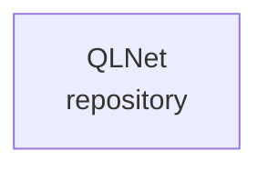

# Technical Architecture — QLNet

> Generated from `.architecture/technical.json`. Do not edit directly; run `python .architecture/generate.py`.

Status: **BASELINE**  
Scope: **repository**

## System schema

## Inventory

- Components: **1**
- Interfaces: **0**
- Data stores: **0**
- External services: **0**
- Internal dependencies: **0**
- External dependencies: **0**
- Architecture decisions: **0**

## Deployment schema

## Update rule

Architecture-impacting commits must update `.architecture/technical.json` and/or `.architecture/commercial.json`, then regenerate both architecture views.
